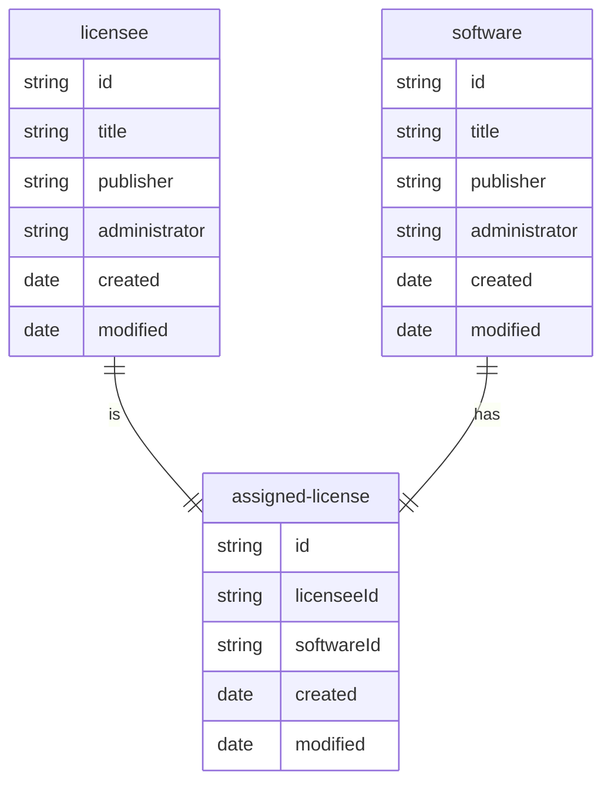

# Technical Documentation

All id fields are of type UUID

## Entity Diagrams

```mermaid
erDiagram
    licensee ||--|| assigned-license: is
    software ||--|| assigned-license: has
    licensee {
        string id
        string title
        string publisher
        string administrator
        date created
        date modified
    }
    software {
        string id
        string title
        string publisher
        string administrator
        date created
        date modified
    }
    assigned-license {
        string id
        string licenseeId
        string softwareId
        date created
        date modified
    }
    
```
